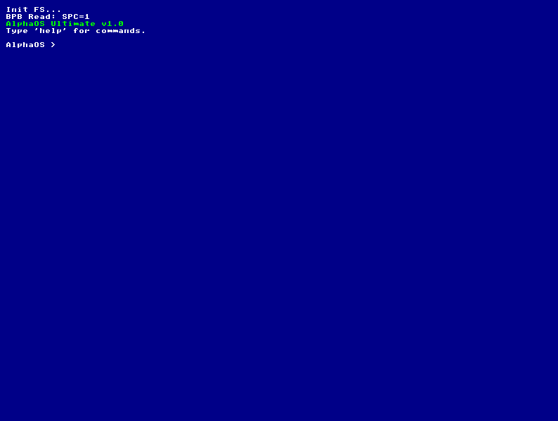

Конечно. Хороший `README.md` — это лицо проекта на GitHub. Он объяснит любому, кто зайдет в репозиторий, что это за ОС, как её собрать и какие в ней есть фичи.

Вот готовый файл. Создай файл `README.md` в корне папки `alphaos` и вставь туда этот текст.

---

# 💿 AlphaOS

**AlphaOS** — это 32-битная операционная система, написанная с нуля на **C** и **Assembly (NASM)**.
Она не использует GRUB или стандартные библиотеки (libc). У неё собственный двухэтапный загрузчик, драйвер файловой системы FAT16, графический интерфейс (VESA) и поддержка мультимедиа.



## Возможности

*   **Ядро:** 32-bit Protected Mode, написанное на C.
*   **Загрузчик:** Кастомный 2-этапный загрузчик (MBR -> Loader -> Kernel).
*   **Графика:** VESA VBE 2.0 (800x600, 24-bit color).
*   **Файловая система:** Полноценный драйвер **FAT16** (Чтение, Запись, Создание файлов, Поиск).
*   **Аудио:** Драйвер **PC Speaker** с программной эмуляцией PWM (ШИМ) для воспроизведения 8-битных **.WAV** файлов.
*   **Графика:** Просмотр изображений **.BMP** (24-bit).
*   **Текст:** Встроенный текстовый редактор.

## Требования

Для сборки и запуска вам понадобится Linux (или WSL на Windows) и следующие пакеты:

```bash
sudo apt update
sudo apt install build-essential nasm qemu-system-x86 mtools python3
```

*   `nasm`: Ассемблер.
*   `gcc`: Компилятор Си.
*   `ld`: Линковщик.
*   `mtools`: Для работы с образом диска FAT16 без sudo.
*   `qemu`: Эмулятор.

## Сборка и Запуск

В проекте используется `Makefile` для автоматизации.

1.  **Сборка образа и запуск:**
    ```bash
    make clean && make run
    ```
    *Эта команда скомпилирует ядро, создаст образ диска `os.img`, сгенерирует тестовые файлы (LOGO.BMP, TEST.WAV) и запустит QEMU.*

## Команды терминала

После загрузки ОС вы попадете в Shell. Доступные команды:

| Команда | Аргумент | Описание |
| :--- | :--- | :--- |
| `ls` | - | Список файлов в корневой директории. |
| `cat` | `filename` | Вывести содержимое текстового файла на экран. |
| `edit` | `filename` | Открыть текстовый редактор. <br>**TAB** — Сохранить, **ESC** — Выход. |
| `mkfile` | `[name]` | Создать новый файл (по умолчанию `NEW.TXT`). |
| `play` | `filename` | Воспроизвести 8-битный WAV файл (например, `TEST.WAV`).<br>Без аргументов играет Имперский марш. |
| `view` | `filename` | Открыть изображение BMP 24-bit (например, `LOGO.BMP`). |
| `clear` | - | Очистить экран. |
| `help` | - | Показать справку. |

## Структура проекта

```text
alphaos/
├── Makefile            # Скрипт сборки
├── linker.ld           # Скрипт линковки ядра
├── logo/               # Папка с ассетами (генерируются скриптом)
└── src/
    ├── arch/x86/       # Ассемблерный код (boot.asm, loader.asm)
    ├── drivers/        # Драйверы железа
    │   ├── audio/      # PC Speaker, WAV parser
    │   ├── video/      # VESA driver, font
    │   ├── input/      # Keyboard driver
    │   └── storage/    # ATA (Hard Disk) driver
    ├── fs/             # Файловая система (FAT16)
    ├── kernel/         # Точка входа (main.c) и Shell
    └── lib/            # Библиотека (string.h, memory functions)
```

## Технические детали

*   **Audio:** Поскольку драйверы для звуковых карт (AC97/HDA) слишком сложны, используется системный динамик (порт 0x61). WAV-плеер читает PCM данные и быстро включает/выключает динамик, создавая грубый 1-битный звук.
*   **Video:** Используется Linear Frame Buffer (LFB). Ядро пишет пиксели напрямую в видеопамять.
*   **Filesystem:** Реализован поиск файлов без учета регистра (`test.wav` == `TEST.WAV`). Драйвер автоматически сканирует диск для поиска начала раздела FAT16.

## Лицензия

Этот проект создан в образовательных целях. Код открыт для использования и модификации.
